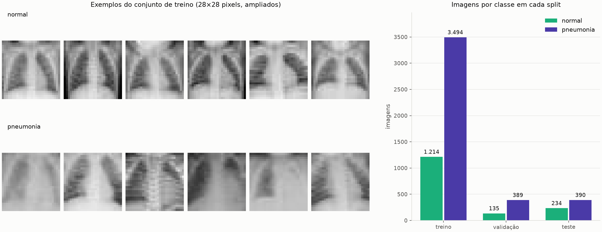
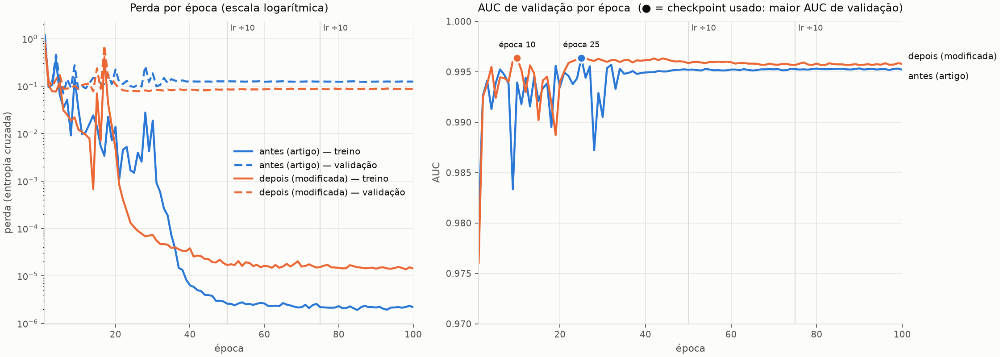

# Menos é mais: enxugando a ResNet-18 do MedMNIST v2 para a escala do PneumoniaMNIST

Relatório técnico — cp-02 Arquiteturas, Tópicos Avançados em IA.
Versão Markdown do [`relatorio_overleaf.tex`](relatorio_overleaf.tex); o conteúdo é o mesmo.

## Resumo

Reproduzimos o *baseline* ResNet-18 do benchmark MedMNIST v2 (2023) no PneumoniaMNIST,
a partir do código oficial dos autores, e propomos uma modificação de arquitetura que
remove o último estágio residual, reduz os blocos por estágio de dois para um e divide a
largura por dois. A rede cai de 11,2 milhões para 307 mil parâmetros. Treinadas com a
mesma receita, a rede original obteve AUC 0,949 e acurácia 0,872 no teste (publicado:
0,944 e 0,854), e a rede modificada obteve AUC 0,964 e acurácia 0,875, treinando 6,8
vezes mais rápido. As curvas de treino mostram que a rede original memoriza o conjunto
de treino e tem a perda de validação crescendo 78% após o seu mínimo, contra 15% na
rede modificada.

## 1. Introdução

Redes convolucionais projetadas para bases grandes, como o ImageNet, são
frequentemente reaproveitadas sem ajuste em bases muito menores. A ResNet-18 [1] tem
cerca de 11 milhões de parâmetros; o PneumoniaMNIST [4], uma das bases do benchmark
MedMNIST v2, tem 4.708 imagens de treino de 28×28 pixels e apenas duas classes. Nessa
desproporção, é razoável suspeitar que boa parte da capacidade da rede não contribui
para generalizar e só serve para memorizar o treino.

O objetivo desta prática é demonstrar como uma modificação de arquitetura impacta uma
rede neural. Para isso (i) selecionamos um artigo de 2023 que aplica uma CNN a uma base
pública, (ii) reproduzimos o seu resultado com o código oficial dos autores,
(iii) modificamos a arquitetura de forma substancial, (iv) retreinamos a rede
modificada na mesma base, com a mesma receita, e (v) comparamos as duas quantitativa e
qualitativamente.

A hipótese testada é que a ResNet-18 do artigo está superdimensionada para o
PneumoniaMNIST, e que uma versão com uma fração dos parâmetros alcança desempenho
equivalente.

## 2. Artigo e rede base

O artigo escolhido é o MedMNIST v2 [4], publicado na *Scientific Data* em 2023. Ele
padroniza 12 bases de imagens biomédicas 2D em 28×28 pixels e publica *baselines* com
código aberto (`github.com/MedMNIST/experiments`). A rede base é a ResNet-18 desse
código, que é a variante para imagens pequenas adaptada do repositório
`kuangliu/pytorch-cifar`: a primeira convolução é 3×3 com passo 1 e não há
*max-pooling* inicial, de modo que a imagem entra nos blocos residuais em resolução
cheia.

Para o PneumoniaMNIST, o artigo reporta AUC 0,944 e acurácia 0,854 para a ResNet-18 em
resolução 28, e AUC 0,948 e acurácia 0,854 para a ResNet-50, que tem cerca de duas
vezes mais parâmetros. A ResNet-50 não melhorar a acurácia foi o primeiro indício que
motivou a modificação.

## 3. Método

### 3.1 Dados

O PneumoniaMNIST deriva de 5.856 radiografias de tórax pediátricas de Kermany et
al. [2], recortadas e reduzidas para 1×28×28 pelos autores do MedMNIST, com rótulo
binário (normal ou pneumonia). Usamos a divisão oficial: 4.708 imagens de treino, 524
de validação e 624 de teste. O arquivo foi conferido pelo MD5 registrado no código dos
autores antes de qualquer treino.

A Figura 1 mostra exemplos das duas classes e a contagem por divisão. A base é
desbalanceada: 74,2% das imagens de treino e de validação são de pneumonia. O teste tem
proporção diferente, 62,5% (390 de 624): os autores do MedMNIST tiraram treino e
validação do conjunto de treino da base de origem, e usaram como teste o conjunto de
validação dela.

*Figura 1 — Exemplos de radiografias de treino de cada classe (esquerda) e número de
imagens por classe em cada divisão (direita).*

### 3.2 Protocolo

Copiamos o projeto oficial dos autores (commit `70b6b3a`) e alteramos apenas a
arquitetura. O diff toca dois arquivos: em `models.py`, a classe `ResNet` passou a
aceitar a largura e o número de estágios como parâmetros; em
`train_and_eval_pytorch.py`, uma linha permite selecionar a nova rede. Verificamos que,
com os valores padrão, a ResNet-18 continua idêntica à original: mesmos nomes e formatos
de parâmetros, mesma contagem e mesma saída para os mesmos pesos. Otimizador,
*scheduler*, pré-processamento, divisão dos dados e métricas são os dos autores, de modo
que a arquitetura é a única variável entre as duas execuções.

A receita de treino é a do artigo: Adam [3], taxa de aprendizado 0,001, lote de 128,
100 épocas, com a taxa dividida por 10 nas épocas 50 e 75. O script dos autores guarda o
*checkpoint* da época com maior AUC de validação, e é esse que avaliamos no teste. As
duas redes foram treinadas em CPU de 4 núcleos, uma após a outra, para que o tempo de
uma não fosse inflado pela disputa de processador com a outra.

### 3.3 A modificação

A Tabela 1 mostra onde estão os parâmetros da ResNet-18 nesta configuração. O quarto
estágio concentra 75,2% da rede e opera sobre mapas de 4×4, resolução em que resta pouca
estrutura espacial de uma radiografia de 28×28.

*Tabela 1 — Distribuição dos parâmetros da ResNet-18 do artigo (1 canal de entrada, 2
classes).*

| Parte | Parâmetros | % da rede | Mapa de saída |
|---|---:|---:|:---:|
| conv. inicial + estágio 1 | 148.672 | 1,3 | 64×28×28 |
| estágio 2 | 525.568 | 4,7 | 128×14×14 |
| estágio 3 | 2.099.712 | 18,8 | 256×7×7 |
| **estágio 4** | **8.393.728** | **75,2** | **512×4×4** |
| classificador | 1.026 | 0,0 | — |
| total | 11.168.706 | 100 | |

A rede modificada, chamada aqui de *enxuta*, aplica três cortes (Tabela 2): remove o
quarto estágio, usa um bloco residual por estágio em vez de dois e divide por dois o
número de filtros de cada estágio. O bloco residual e a estrutura geral da ResNet são
mantidos.

*Tabela 2 — Arquitetura antes e depois da modificação.*

| | ResNet-18 (artigo) | Enxuta |
|---|:---:|:---:|
| Estágios residuais | 4 | 3 |
| Blocos por estágio | 2, 2, 2, 2 | 1, 1, 1 |
| Filtros por estágio | 64, 128, 256, 512 | 32, 64, 128 |
| Resolução ao longo da rede | 28→28→14→7→4 | 28→28→14→7 |
| Parâmetros | 11.168.706 | 307.042 |

A justificativa tem três partes: a proporção de cerca de 2.400 parâmetros por imagem de
treino; a própria tabela do artigo, em que dobrar a rede não melhorou a acurácia; e o
fato de o estágio que mais pesa ser justamente o que enxerga a menor resolução.

### 3.4 Etapas, ferramentas e uso de IA

O trabalho seguiu as etapas: (1) busca e seleção do artigo, restrita a publicações de
2023 em diante; (2) cópia do código oficial e verificação de que a rede base não foi
alterada; (3) análise da distribuição de parâmetros e escolha da modificação; (4) treino
das duas redes no PneumoniaMNIST; (5) comparação e redação deste relatório. As
bibliotecas são as do código dos autores (PyTorch, `medmnist`) mais `matplotlib`,
`scikit-learn` e `tensorboard` para as figuras.

Todo o código, a execução dos experimentos e o rascunho deste relatório foram produzidos
pelo **Claude Code** (Anthropic), sob a direção do autor, conforme a orientação da
disciplina de conduzir o trabalho comandando a IA. O autor definiu as restrições (artigo
de 2023 em diante, base de tema próximo), escolheu a base e a modificação entre as opções
propostas pela IA e revisou os resultados. Para evitar alucinações, cada número do texto
foi conferido contra o arquivo que o produziu (Tabela 4), e as referências foram
conferidas nas fontes dos próprios autores.

## 4. Resultados

### 4.1 Reprodução da rede base

A ResNet-18 obteve AUC 0,949 e acurácia 0,872 no teste, contra 0,944 e 0,854
publicados. A diferença é compatível com a variação entre execuções: o script dos
autores não fixa semente aleatória. Consideramos a reprodução válida e usamos essa
execução como referência do "antes".

### 4.2 Comparação quantitativa

*Tabela 3 — Resultados no conjunto de teste (624 imagens). Sensibilidade é a fração de
casos de pneumonia detectados; especificidade, a fração de casos normais reconhecidos
como normais.*

| | ResNet-18 (artigo) | Enxuta | Publicado [4] |
|---|:---:|:---:|:---:|
| Parâmetros | 11.168.706 | **307.042** | — |
| AUC | 0,949 | **0,964** | 0,944 |
| Acurácia | 0,872 | **0,875** | 0,854 |
| Sensibilidade | 0,985 | 0,982 | — |
| Especificidade | 0,684 | 0,697 | — |
| Treino (100 épocas) | 119 min | **17 min** | — |
| Inferência por imagem | 4,3–4,8 ms | **0,55–0,61 ms** | — |

Com 36 vezes menos parâmetros, a rede enxuta obteve AUC 0,015 maior e acurácia
praticamente igual, treinou 6,8 vezes mais rápido e infere de 7 a 8 vezes mais rápido
(três medições). A hipótese se confirma: a redução não custou desempenho.

### 4.3 Curvas de treino

A Figura 2 mostra a perda e a AUC de validação por época. As duas redes levam a perda de
treino a valores entre 10⁻⁶ e 10⁻⁵ e chegam a 100% de acurácia no treino, ou seja, ambas
memorizam o conjunto de treino, o que é esperado de redes profundas com capacidade
suficiente [5]. A diferença está na validação: a perda de validação da ResNet-18 atinge
o mínimo na época 6 (0,070) e termina 78% acima dele (0,125), enquanto a da rede enxuta
termina apenas 15% acima do seu mínimo (de 0,076 para 0,088). É o padrão de sobreajuste
que motivou a modificação, e ele é bem mais fraco na rede menor.

Os *checkpoints* escolhidos pela AUC de validação vieram das épocas 25 (ResNet-18) e 10
(enxuta), antes das reduções da taxa de aprendizado. Nas duas redes, as últimas 50
épocas não melhoraram a validação.

*Figura 2 — Perda (escala logarítmica) e AUC de validação por época. Linhas contínuas:
treino; tracejadas: validação. Os círculos marcam o checkpoint usado no teste.*

### 4.4 Comparação qualitativa

As matrizes de confusão (Figura 3) mostram que as duas redes erram do mesmo lado:
detectam 98% dos casos de pneumonia, mas reconhecem só cerca de 70% dos casos normais
(160 e 163 de 234), classificando os demais como pneumonia. É o reflexo do
desbalanceamento do treino, e a modificação não o altera.

*Figura 3 — Matrizes de confusão no teste. Cor: fração da linha; rótulo: contagem e
fração.*

As curvas ROC (Figura 4) ficam próximas, com a da rede enxuta acima na região de poucos
falsos positivos, que é onde a diferença de AUC se concentra. Imagem a imagem, as duas
redes erram juntas em 60 radiografias e discordam em apenas 38: a enxuta acerta 20 delas
e a ResNet-18, 18 (Figura 5). A diferença de acurácia entre as duas é, portanto, de duas
imagens.

*Figura 4 — Curvas ROC das duas redes no teste.*

*Figura 5 — Exemplos de radiografias em que as redes discordam, com o rótulo verdadeiro
e a previsão e confiança de cada uma.*

### 4.5 Rastreabilidade

A Tabela 4 indica de qual arquivo do repositório sai cada número apresentado nesta
seção, para que qualquer um deles possa ser conferido ou regenerado.

*Tabela 4 — Origem de cada número (caminhos relativos a esta pasta).*

| Número | Arquivo |
|---|---|
| AUC e acurácia | `resultados/{antes,depois}/pneumoniamnist_log.txt` |
| Matriz de confusão, discordâncias | CSVs de teste em `resultados/` |
| Curvas, épocas escolhidas | `resultados/*/Tensorboard_Results/` |
| Tempo de treino | `resultados/execucao.log` |
| Tempo de inferência | `resultados/comparacao.txt` |
| Parâmetros por estágio | `verificacao/contar_parametros.py` |
| Distribuição das classes | `dados/pneumoniamnist.npz` |

## 5. Discussão e limitações

**Execução única.** Cada rede foi treinada uma vez, sem semente fixa. Como a diferença
de acurácia é de duas imagens, não afirmamos que a rede enxuta é melhor; afirmamos que
ela não perdeu desempenho. Repetir cada treino algumas vezes e comparar médias
permitiria uma conclusão mais forte sobre a AUC.

**Mudança de proporção entre validação e teste.** A validação tem 74,2% de pneumonia e
o teste, 62,5%. Como as redes tendem a responder "pneumonia" na dúvida, erram mais onde
há mais casos normais, o que é compatível com a queda de acurácia de 96–97% na validação
para cerca de 87% no teste nas duas redes.

**Especificidade baixa.** As duas redes reconhecem só cerca de 70% dos casos normais.
Isso decorre dos dados, não da arquitetura, e exigiria outras intervenções, como
ponderar as classes na função de perda.

**Escala das imagens.** As radiografias originais chegam a 2.916×2.713 pixels; em
28×28, nada aqui indica desempenho clínico. O objeto de estudo é a arquitetura, não o
diagnóstico.

**Espaço para reduzir mais.** A rede enxuta também chega a 100% de acurácia no treino, o
que sugere que ela ainda tem capacidade sobrando.

## 6. Conclusão

Reproduzimos o *baseline* ResNet-18 do MedMNIST v2 no PneumoniaMNIST, com resultado
próximo ao publicado, e mostramos que a rede está superdimensionada para essa base: o
seu maior estágio, com 75% dos parâmetros, pode ser removido junto com metade dos blocos
e metade dos filtros. A rede resultante tem 36 vezes menos parâmetros, treina 6,8 vezes
mais rápido, sofre menos sobreajuste e mantém o desempenho no teste (AUC 0,964 contra
0,949; acurácia 0,875 contra 0,872). Para esta base, o tamanho da rede do artigo não se
traduz em ganho de generalização.

## Referências

1. He, K., Zhang, X., Ren, S., Sun, J.: Deep residual learning for image recognition.
   In: Proceedings of the IEEE Conference on Computer Vision and Pattern Recognition
   (CVPR), pp. 770–778 (2016)
2. Kermany, D.S., Goldbaum, M., et al.: Identifying medical diagnoses and treatable
   diseases by image-based deep learning. Cell 172(5), 1122–1131.e9 (2018)
3. Kingma, D.P., Ba, J.: Adam: A method for stochastic optimization. In: International
   Conference on Learning Representations (ICLR) (2015)
4. Yang, J., Shi, R., Wei, D., Liu, Z., Zhao, L., Ke, B., Pfister, H., Ni, B.: MedMNIST
   v2 — A large-scale lightweight benchmark for 2D and 3D biomedical image
   classification. Scientific Data 10(1), 41 (2023)
5. Zhang, C., Bengio, S., Hardt, M., Recht, B., Vinyals, O.: Understanding deep learning
   requires rethinking generalization. In: International Conference on Learning
   Representations (ICLR) (2017)
